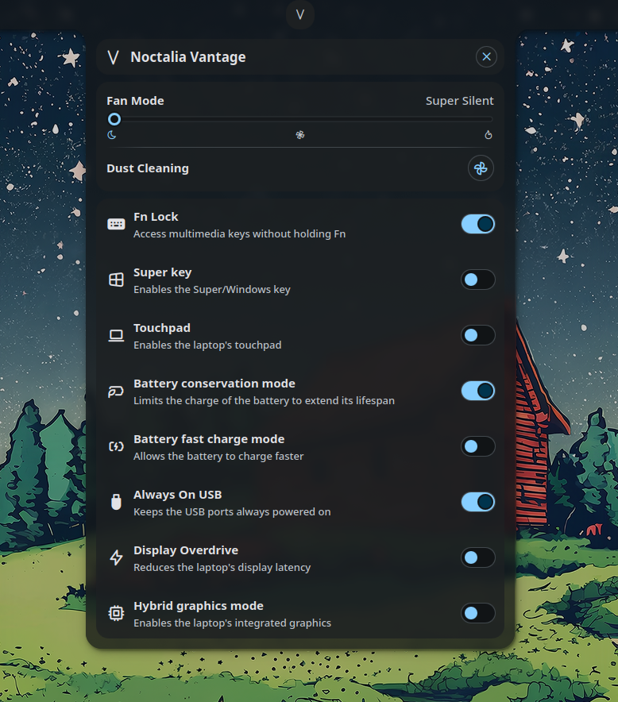

# Noctalia Vantage



An unofficial [Noctalia Shell](https://noctalia.dev/) plugin to bring [Lenovo Vantage](https://www.lenovo.com/us/en/software/vantage/) features to Linux.

> [!NOTE]
> Please open issues and send PRs at <https://github.com/wizard-28/NoctaliaVantage> and **NOT** to the [noctalia-plugins](https://github.com/noctalia-dev/noctalia-plugins) repository!

## Requirements

- [LenovoLegionLinux](https://github.com/johnfanv2/LenovoLegionLinux) kernel module for:
  - Super key toggle
  - Touchpad toggle
  - Battery fast charging mode
  - Display overdrive
  - Hybrid GPU mode

- Ideapad kernel module (already in the stable linux kernel) for:
  - Fan control
  - Fn lock toggle
  - Battery conservation mode
  - Always ON USB Charging

## Password-less operation

This plugin supports password-less operation.
If you don't want to input your password for every change,
you have to make the relevant sysfs files writeable by the user.
To set this up, run this

```bash
sudo scripts/setup.sh
```

This makes the relevant files writable by the `vantage` group
and adds your user to that group.

## Issues

- `Standard` and `Efficient Thermal Dissipation` fan control modes don't work on
  my Ideapad. They operate like `Dust Cleaning` mode.

## Disclaimer

- This project is **NOT AFFILIATED WITH LENOVO IN ANY WAY**.
- **THIS PLUGIN COMES WITH NO WARRANTY AND SHOULD BE USED AT YOUR OWN RISK**.

## License

GNU Public License 3.0 or later

## Credits

- [PlasmaVantage](https://gitlab.com/Scias/plasmavantage) for showing how to do things.
- [ideapad-battery-health](https://github.com/noctalia-dev/noctalia-plugins/tree/main/ideapad-battery-health) for showing how to do rest of the things.
